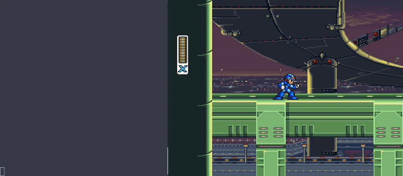
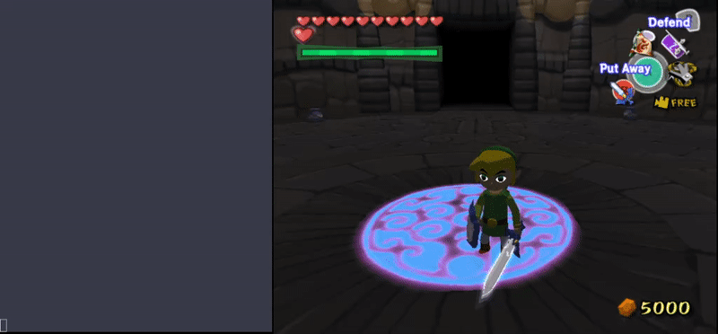

Here you'll find simple examples aimed at concisely demonstrating TRBot's capabilities.

In all examples, the default input duration is **200 milliseconds**, and the `.` and `#` inputs function as blank inputs.

## Shoot + Charge

Input sequence:
- [y100ms #34ms]*3 #500ms y2500ms

### Breakdown

This sequence makes the player shoot three times then fire a Charge Shot. The three shots are accomplished by pressing Y for 100 milliseconds followed by a very brief 34 millisecond delay. This sequence is repeated three times. Since there can be only three player projectiles on screen at a time, it waits half a second until they're all gone, then holds Y for 2.5 seconds to charge up. The Charge Shot is fired after Y is released.

## Sideflip

Input sequence:
- _down . . -down+_up a1s

### Breakdown

The slideflip requires some speed, followed by a sudden change in direction. This sequence builds speed by running down briefly, then switches direction rapidly by releasing down and holding up. It then performs a sideflip by jumping with A after the direction change. A is held for 1 second to gain enough height on the sideflip to grab the basket.

## Spin Attack

Input sequence:
- _up17ms _right17ms -up17ms _down17ms -right17ms _left17ms -down17ms _up17ms -left17ms b

### Breakdown

The Spin Attack requires rotating the control stick followed by pressing B. The sequence accomplishes this through very brief (approx. 1 frame) holds and releases in a clockwise direction. It makes sure to hit all 8 cardinal directions on the control stick, completing the circle by holding up at the end, before pressing B.

For more details on the input syntax, read through the [walkthrough](./Syntax-Walkthrough.md) or the more in-depth [tutorial](./Syntax-Tutorial.md). View more advanced examples from playthroughs [here](./Real-Usage-Examples.md).
