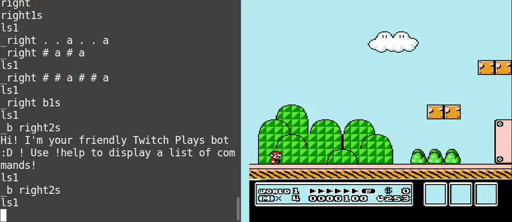

Welcome to the syntax walkthrough! This short, but handy, guide will show you all you need to know about TRBot's input syntax.

This walkthrough will be demonstrating the input syntax using a well-known game, Super Mario Bros. 3 for the NES. All the inputs typed in the GIFs can be found at the end of each section.

## Pressing Buttons

Simply type any valid input to press the associated button.

Inputs typed:
- a
- right
- a

