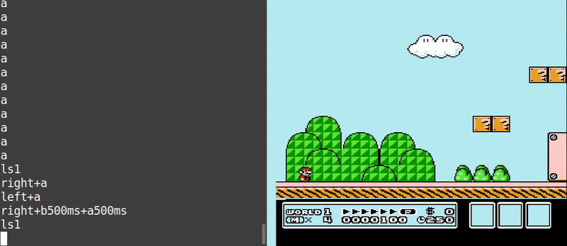
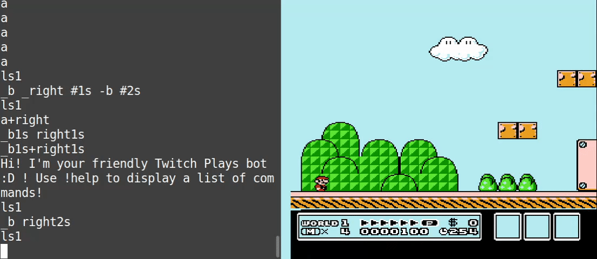

Welcome to the syntax walkthrough! This short, but handy, guide will show you all you need to know about TRBot's input syntax.

This walkthrough will be demonstrating the input syntax using a well-known game, Super Mario Bros. 3 for the NES. All the inputs typed in the GIFs can be found at the end of each section.

For reference, here are all the available inputs for the NES, which are used throughout the guide:
- a
- b
- start
- select
- up
- down
- left
- right
- # (blank input)

## Pressing Buttons

Simply type any valid input to press the associated button. Notice how Mario reacts to the inputs being pressed.

Inputs typed:
- a
- right
- a

## Input Duration

Now let's make Mario walk farther to the right in a single command. You can specify a duration for how long to press an input, in either milliseconds (ms) or seconds (s). Notice how Mario walks farther than before.

If not specified, the default duration is **200 milliseconds**.

Inputs typed:
- right1s
- left500ms
- a1s

## Input Sequences

That wasn't good enough, so let's make Mario do more! Let's have him run right, jump, then move left mid-jump.

You can type more than one input in a single line and have them complete in order. Once an input is completed, the next will follow. This is known as an input sequence. Notice how Mario jumps after moving right, then soon afterwards veers to the left.

Inputs typed:
- right500ms a left1s

## Holding Inputs

Let's make Mario run! To do that, we need to hold B **while** moving. Prepend your input with "_" to continue holding it until the end of the input sequence.

Inputs typed:
- _b right2s

## Delaying Inputs

That's great, but what if we need to time our jump? We need to **wait** after moving, *then* jump. You can delay any input by pressing a "blank" input, or one that doesn't actually do anything! In this case, the blank input is "#".

Inputs typed:
- right #200ms a
- _right #1s

For the first input sequence, Mario waits 200 milliseconds after moving right then jumps. In the next input sequence, Mario continues moving right for 1 second because we held right then delayed for 1 second. That's right, blank inputs can have durations too!

## Releasing Held Inputs

What if we want Mario to run for a bit, then walk but not stop moving? We need to **release B while Mario is still moving**. Prepend your input with "-" to release any held inputs early.

Inputs typed:
- _b _right #1s -b #2s

Notice how the Mario slows down and the P Meter decreases after releasing b yet continues to walk for 2 more seconds. 

## Simultaneous Inputs

Super Mario Bros 3. is a precise platformer, so we'll need Mario to do more than one thing at the same time. You can combine inputs by chaining them with "+".

Inputs typed:
- a+right
- _b1s right1s
- _b1s+right1s

In the first input sequence, Mario jumps and moves right at the same time. In the second input sequence, Mario doesn't move until after "b" is held for 1 second. We fix this in the third input sequence by chaining b and right, causing Mario to run immediately.
