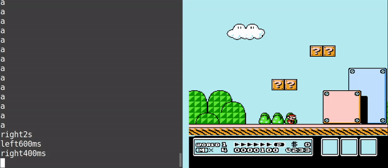
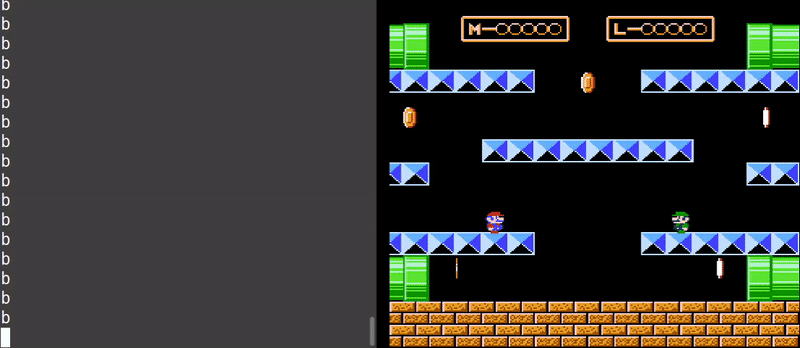
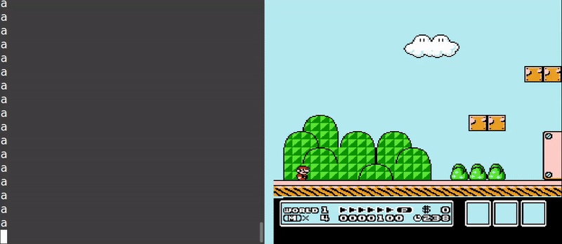

Welcome to the syntax walkthrough! This short tutorial will show you all the essentials about TRBot's input syntax.

This walkthrough will be demonstrating the input syntax using a well-known game, Super Mario Bros. 3 for the NES. All the inputs typed in the GIFs can be found at the end of each section.

For reference, here are all the available inputs for the NES, which are used throughout the walkthrough:
- a
- b
- start
- select
- up
- down
- left
- right
- &#35; (blank input)

## Pressing Buttons

Simply type any valid input to press the associated button. Notice how Mario reacts to the inputs being pressed.

Inputs typed:
- a
- right
- a

## Input Duration

Now let's make Mario walk farther to the right in a single command. You can specify a duration for how long to press an input, in either milliseconds (ms) or seconds (s). Notice how Mario walks farther and jumps higher when we specify longer durations.

If not specified, the default input duration is **200 milliseconds**.

Inputs typed:
- right1s
- left500ms
- a1s

## Input Sequences

That wasn't good enough, so let's make Mario do more! Let's have him run right, jump, then move left mid-jump.

You can type more than one input in a single line and have them complete in order. Once an input is completed, the next will follow. This is known as an input sequence. Notice how Mario jumps after moving right, then soon afterwards veers to the left.

Input sequences are capped by the max input duration, which is by default **60 seconds**.

Inputs typed:
- right500ms a left1s

## Holding Inputs

Let's make Mario run! To do that, we need to hold B **while** moving. Prepend your input with "_" to continue holding it until the end of the input sequence.

Inputs typed:
- _b right2s

## Delaying Inputs

That's great, but what if we need to time our jump? We need to **wait** after moving, *then* jump. You can delay any input by pressing a "blank" input, or one that doesn't actually do anything! In this case, the blank input is "#".

Inputs typed:
- right #200ms a
- _right #1s

For the first input sequence, Mario waits 200 milliseconds after moving right then jumps. In the next input sequence, Mario continues moving right for 1 second because we held right then delayed for 1 second. That's right, blank inputs can have durations too!

## Releasing Held Inputs

What if we want Mario to run for a bit, then walk but not stop moving? We need to **release B while Mario is still moving**. Prepend your input with "-" to release any held inputs early.

Inputs typed:
- _b _right #1s -b #2s

Notice how Mario slows down and the P Meter decreases after releasing b, yet he continues walking for 2 more seconds. 

## Simultaneous Inputs

Super Mario Bros 3. is a precise platformer, so we'll often need Mario to do more than one thing at the same time. You can combine inputs by chaining them with "+".

Inputs typed:
- a+right
- _b1s right1s
- _b1s+right1s

In the first input sequence, Mario jumps and moves right at the same time. In the second input sequence, Mario doesn't move until after "b" is held for 1 second. We fix this in the third input sequence by chaining b and right, causing Mario to run immediately.

## Repeated Inputs

Next, let's make Mario jump many times in succession. This is useful for getting multiple coins from a block. For this, we'll need to **repeat the input sequence** several times.

To repeat an input sequence, enclose it in brackets, followed by "\*" and the number of times to repeat it. A template is "[myinput]\*#", with "myinput" being the input sequence and "#" representing the number of repetitions.  

Inputs typed:
- [a #350ms]*6

In the above, we repeat Mario jumping for 200 milliseconds then waiting for 350 milliseconds, 6 times. Where'd the 200 milliseconds come from? The "a" input did not have a duration specified, so its duration is the default, 200 milliseconds. The total length for this command is 3300 milliseconds ((200 + 350) * 6).

## Multi-Controller Inputs

What if we wanted Luigi to join in on the adventure? Introducing multi-controller inputs! That's right, we can control BOTH Mario and Luigi in a single input sequence! Prepend your input with "&" followed by a controller port number. This goes even **before** holds or releases.

Inputs typed:
- left
- &2right
- _left+&2_right #250ms a1s+&2a1s

Notice how we chose to explicitly make Luigi move right on the second input sequence. On the third input sequence, we chain Mario and Luigi's inputs together so they move at the same time. As Nintendo would say, "Now you're playing with power!"

You might be wondering why we don't have to specify player 1's inputs. That's because our default controller port is set to 1. If it was set to 2, we would control Luigi by default and have to type "&1" for Mario's inputs! You can view or change your controller port using the `ControllerPortCommand` (default: "!port").

## Input Macros

That's a whole lot to absorb! I wish there was an easy way to store an input sequence so I can use it later...

Input macros to the rescue! Input macros are stored input sequences that can be performed at any time. Input macros start with "#" followed by a descriptive name, such as "moveright".

Inputs typed:
- #moveright

Notice how Mario still moved right, showing that the "#moveright" macro was replaced with the "right1s" input it corresponds to. In games such as Super Mario 64, where the character has moves that are performed through a sequence of inputs, macros can be a very powerful asset and eliminate the tedium involved in remembering and performing these moves. Anyone can use input macros, and they can even contain other input macros!

Note that **adding**, not using, input macros requires sufficient permissions, which may vary depending on the TRBot instance you're interacting with. By default, you can view macros with the `ListMacrosCommand` (default: "!macros") and add them with the `AddMacroCommand` (default: "!addmacro").

## Closing

Here is one final example culminating everything we've learned. Let's have Mario play through some of the level!

Inputs typed:
- _b+right1467ms -right+left #120ms a300ms left50ms #300ms a -b600ms _right100ms a -right #1200ms _right250ms a1s -right #600ms a

Now, how did we come up with this input sequence? Through trial and error - playing games through text takes practice and patience! This input sequence alone took 10 minutes of tweaking to get just right.

As you gain more experience playing with TRBot, you might find it easier to estimate durations and know when to use the techniques you've learned so far. In the end, it can be immensely fun and satisfying, moreso if you can work with others to complete goals through this different means of play.

Here are a few final tips and tricks that may be useful during your playthroughs:
- Factor in the state of the playable character while playing. If your character is in the air or a lengthy animation, chances are they can't jump or take another action until they're back on their feet or finished with what they were doing. Time your delays accordingly! 
- Reaction-based parts of games, such as real-time combat, are often surprisingly difficult to play through text. Most games have a way to slow the game down in some way, including pausing it (hint, hint). Pause buffering, which involves unpausing, entering your actions, then pausing again, is one way to deal with these situations. Another can be to tackle it with the longest, most awesome macro you can come up with to complete the whole thing in one go (these are often clip-worthy)!

What comes next? Give TRBot a try and [set up your own](./Setup-Init.md), or play through an instance deployed on a Twitch stream. Players have achieved great feats using TRBot in [past game playthroughs](./Real-Usage-Examples.md)!

For even more details on the input syntax, including dynamic macros and how to specify percentages for analog inputs, read the more technical [syntax tutorial](./Syntax-Tutorial.md).
